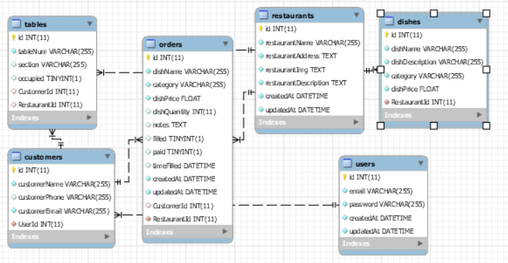

# Team Grapes:
  Chris Dixon
  Hava Edelstein
  Mike Stewart 
  Leo Hargette
  
# Motivation for the Restaurant Management System
Restaurants operate at a high capacity and fast pace. We believe technology will provide the greatest opportunity to remove current operating restrictions and create better efficiency for restaurant operators, owners, and customers. This app is a proof-of-concept Restaurant Management System application allowing restaurant customers to seat themselves, place their own orders, and pay without waiting for a human server. Additionally, the orders are transmitted to the kitchen electronically, ensuring that the order is correct.

# GRAMS by Grapes Description 

GRAMS by Grapes has been the most ambitious project most of the contributors have been a part of to date. For some time now with the addition of smart phones to our society, it has been possible for restaurant owners to reduce their operating costs with regards to the amount of menus they choose to print, and the amount of staff they choose hire.

With GRAMS, restaurant owners/managers are able to shift some of the duties traditionally left for staff on to their customers. Through the restaurant managers UI, owners are currently able to "add a restaurant", select how many tables are in that restaurant, and insert the menu for that restaurant. There is also section for owners to monitor customers' orders as they come in across their stores.

Customers interact with GRAMS through the customer UI. Currently with only "walk-in" functionality, customers select the restaurant that they are currently in. An SVG image then populates the screen below the chosen restaurant. The SVG shows the user the floor plan of the restaurant (a premium feature that is being shown off with our seed data). Each table shown in the restaurant corresponds with a number. When a user selects a table, that table in the database becomes occupied and turns red in the SVG file from otherwise being green for available. After a table is selected the user is able to click on the order button which shows the user the restaurants menu.

After a user finishes ordering that order is sent to the kitchen view (currently can be seen in the restaurant owners UI) where it will give information on the table, the customer, and how they would like there food prepared.

# Application Deployment
To see the customers view, go to: https://gramsbygrapes.herokuapp.com/customers.html
To see the restaurant view, go to: https://gramsbygrapes.herokuapp.com/grams/my-restaurants

# Technologies in use 
HTML
CSS
Javascript
JQuery
Node.JS
Express.JS
Sequelize
MySQL
SVG (Scalable Vector Graphics)
Heroku/JawsDB

### SVG Notes
This app is a proof-of-concept app created to be a “system” such that additional restaurants can easily sign up for the service. Our project group is envisioning that a Restaurant Service Management System would be a subscription service, where restaurant owners would pay a small monthly tiered fee based on the number of customers and/or number of restaurants they wish to support. Additionally, each restaurant would pay a tiered setup feature based on the level of support they require in getting set up, and whether they wish to utilize the premium “restaurant layout” feature. (With this premium feature, a customer would select their table by clicking on the table number in a graphical layout; in the non-premium feature, the customer will use a simple drop-down menu.)

After making a decision to create a restaurant layout file for each restaurant, this left the problem of how to create a sustainable method of creating restaurant layouts. Our goals were as follows:

* Even a non-programmer needed to be able to create the restaurant layout file, so that a restaurant owner or someone on the restaurant staff could create it. (While the restaurant could pay a premium fee to have the layout file created for them, we still felt this task should be as simple as possible so that non-programmer could do it, as greater flexibility in who can do the task would allow it to get done faster.)

* The layout needed to be responsive so that it can be resized up and down without degradation in quality.

* The chosen needed to be supported across browsers and devices.

After some research, we decided on SVG (Scalable Vector Graphics) files. Because this file format uses vectors and lines and not bitmaps, it can be resized up and down without the quality degradation that can be seen when using bitmap/raster formats. Additionally, there are multiple programs on the market (e.g. SmartDraw) featuring easy drag-and-drop interfaces that can be used to create room layouts, and then exported in the SVG file format.

After creating a layout file in the SVG format, the only other step needed to prepare the file for use in our Restaurant Management System is to apply some simple styling to the shapes that represent tables in order that the app can recognize that these shapes are tables. 

SVG does not natively work with jquery; we used an external library called svg.js in this project in order to access svg elements via jquery syntax.

### Express.js, Node.js, Sequelize ORM Notes
This application follows the MVC model. 

The Sequelize npm package was used as our object-relational mapper (ORM) between our MySQL database and our server. Within the models folder, you can inspect the models and their associations, which together, forms the backbone of our application.   

Below is a reverse engineered illustration of the tables and the associations between each of the tables being used:

The back-end of this application is served using the Express.js framework for Node.js. Our controllers can be found in the routes folder. It is here that a fully RESTful API resides. Although not all of the routes are currently be used by the front-end, the architecure is already there to make future enhancements to our UI.

### Conclusion
There is still plenty of work to be done on this project to get to version 1.0. Due to time constraints and the small amount of project contributors, the UI is a major focus in the upcoming development cycle, as well as getting the application properly deployed to Heroku so that no functionality is lost between the development and deployment phases.  